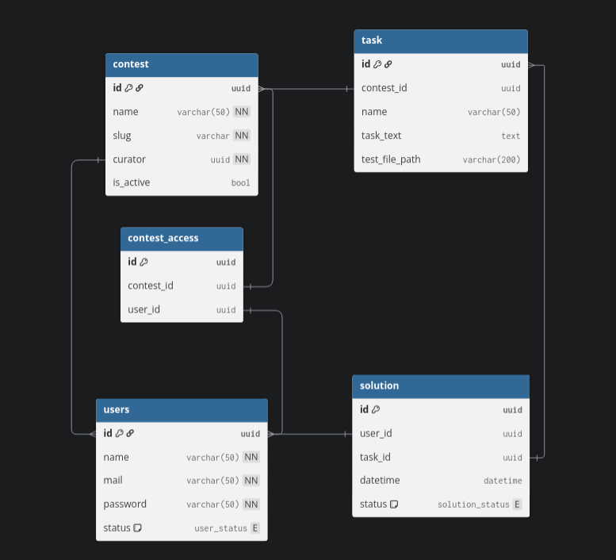

https://dbdiagram.io/d/69e7972ad80a958d1c9e0d29

эндпоинты:
  1. управление пользователями
  2. управление контестами  и заданиями
  3. получение задач контеста
  4. обработка решений

Инструкция по Makefile:
### Запуск
`make build up migrate`

### Остановка
`make down`

### При изменении в коде
`make rebuild`

